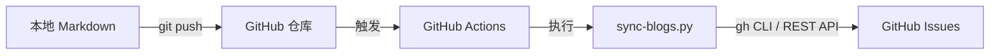
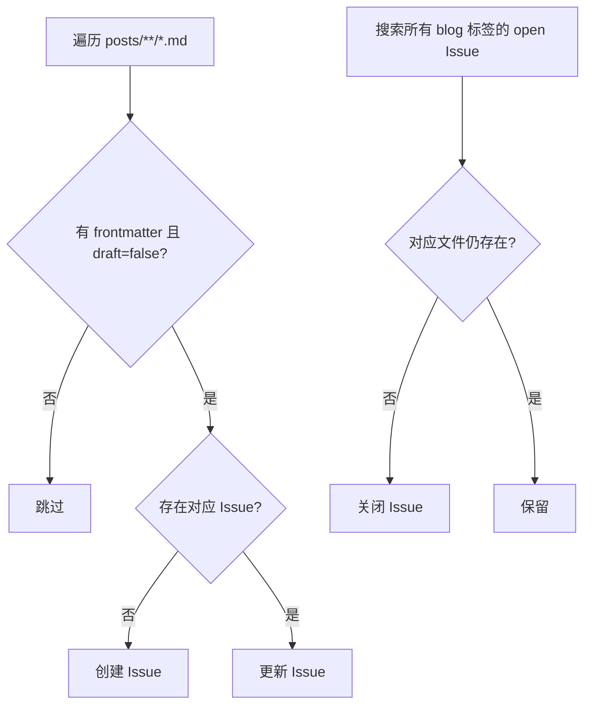
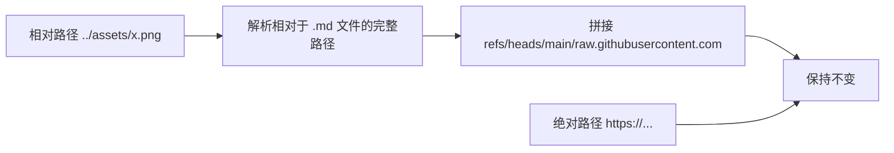
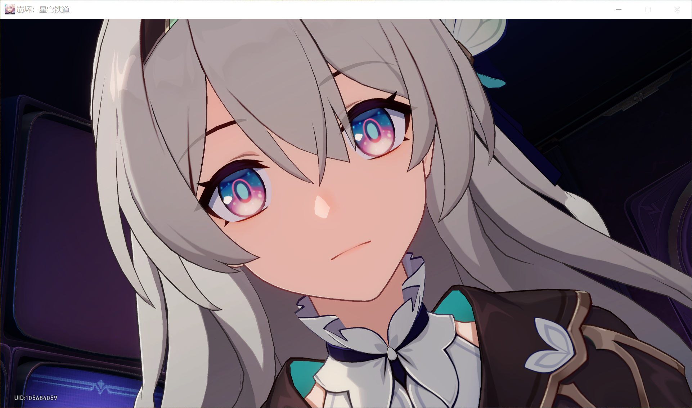

## 动机

搭建个人博客通常需要一个独立的站点或托管服务：Hexo/Hugo 需要构建部署，WordPress 需要维护服务器，Notion 博客需要第三方同步工具。

GitHub Issues 原生具备 Markdown 渲染、标签系统、评论、搜索、时间线和交互反馈等功能，本身就是一个轻量级内容管理平台。将 Markdown 文件与 Issue 同步，可以同时保留本地版本控制的便利和 GitHub 原生的发布能力。

## 设计

### 架构



### 字段映射

博客元数据以 YAML frontmatter 写入 `.md` 文件，同步时映射到 Issue 原生字段：

| Frontmatter | Issue 字段 | 说明 |
|---|---|---|
| `title` | Issue Title | 博文标题 |
| `tags` | Issue Labels | 标签，自动规范化 |
| `draft: true` | 跳过同步 | 本地草稿标记 |
| `cover` | `` 标签 | 封面图，插入正文顶部 |
| `description` | `>` 引用块 | 摘要，插入封面下方 |
| `created_at` / `updated_at` | Issue 时间戳 | 由 GitHub 自动维护 |
| 正文内容 | Issue Body | 原始 Markdown 内容 |

### 同步策略

采用双向全同步策略：



### Issue 与文件的映射

在 Issue body 末尾追加 HTML 注释作为隐藏标识：

```html
<!-- blog-sync: path=posts/2026-05-07-hello-world.md -->
```

同步时通过 `gh issue list` 拉取所有 `blog` 标签的 Issue，在内存中按此标识建立 `{文件路径: Issue 编号}` 映射，避免使用 GitHub 搜索索引（HTML 注释不被索引）。

### 图片路径处理

Issue 中对相对路径的解析基准与仓库文件不同，需将所有本地图片路径转换为绝对 URL：



转换规则：
- `../assets/figures/test.png` → `https://raw.githubusercontent.com/{owner}/{repo}/refs/heads/main/assets/figures/test.png`
- `https://...` 开头的 URL 保持不变
- 封面图路径也经过相同转换

## 实现

### 项目结构

```
.github/
├── scripts/sync-blogs.py      # 同步脚本（Python + pyyaml）
└── workflows/sync-blog.yml    # GitHub Actions 工作流
posts/
└── *.md                        # 博客文章
assets/
└── figures/                    # 图片资源
```

### 工作流

- 触发条件：`push` 到 main 分支且仅当 `posts/**/*.md` 变更
- 提供 `workflow_dispatch` 手动触发入口
- 使用 `concurrency` 避免并发重复执行
- 权限最小化：`issues: write` + `contents: read`

### 同步脚本

Python 脚本，仅依赖 `pyyaml`。所有 GitHub 操作通过 `gh` CLI 和 REST API 完成：

1. **拉取映射**：`gh issue list --label blog` 获取所有 open 博客 Issue，解析 body 中的隐藏标识建立文件映射
2. **正向同步**：遍历 `.md` 文件，命中映射则更新 Issue，否则创建新 Issue
3. **反向同步**：遍历内存映射，文件不存在则关闭对应 Issue

创建 Issue 时使用 `POST /repos/{owner}/{repo}/issues` REST API，避免 `gh issue create` 在处理长 body 和标签时的参数限制。更新 Issue 时使用 `PATCH` 接口直接更新 title、body 和 labels。


